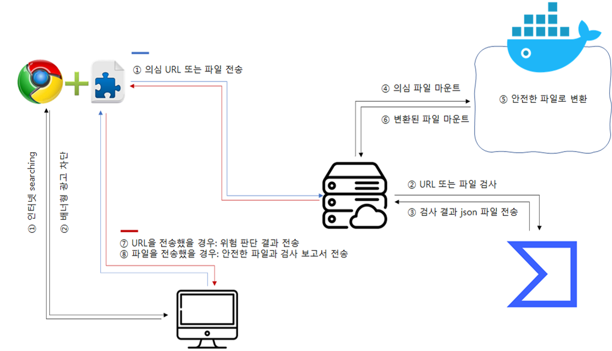

# 오픈소스 기반 APT 공격 예방 Chrome extension 개발

기존의 [Dangerzone](https://github.com/firstlookmedia/dangerzone)에서 지원하는 확장자 외에 추가적으로 HWP 확장자를 지원하고, 메일로 전달되는 URL이 안전한 사이트인지 UI를 통해 알려주는 기능과 더불어 배너형 광고 차단 기능을 가진 Chrome extension 개발

# 팀원

|김두원(PM)|김희은|성지훈|한광석|
|--------------------|--------------------|--------------------|--------------------|
|Chrome extension FE  Web BE: Django| 악성 URL 분석   광고 차단 기능|사용자 UI 설계 및 연동 Chrome estension API 연동 VirusTotal API 활용한 알고리즘 설계|Dangerzone 분석 및 HWP 추가 파일검사: VirusTotal API Dangerzone converter: Docker Web BE: Django

# 시연

[시연 동영상](https://youtu.be/nK7LVAU7bTk)